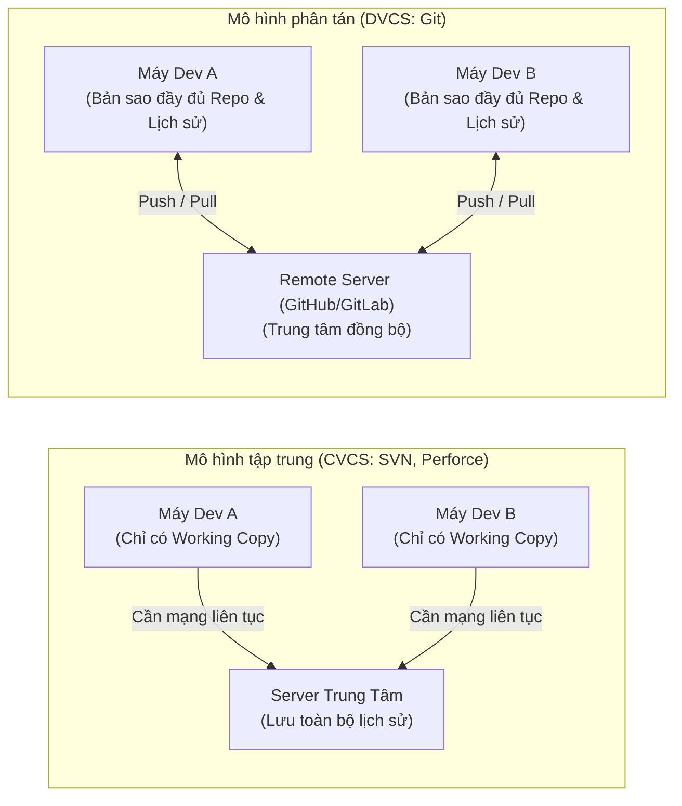
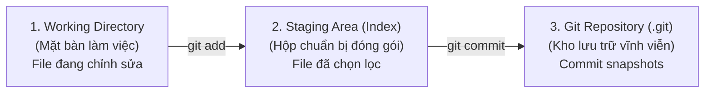
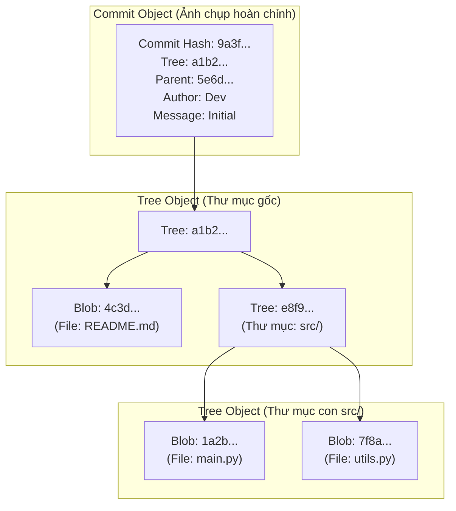
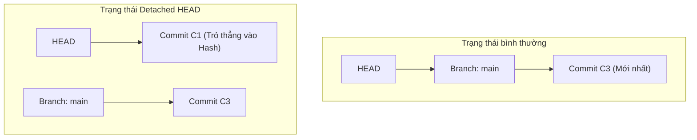
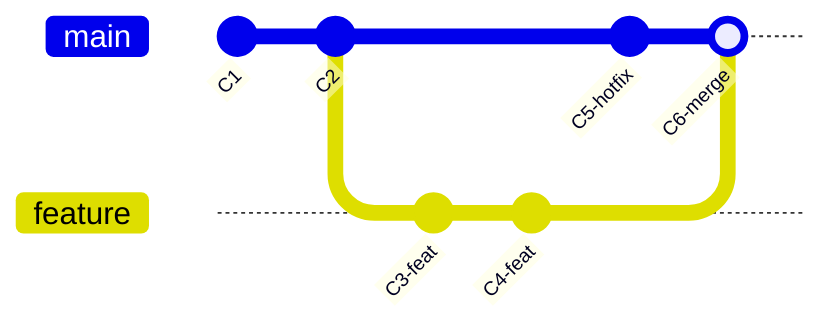
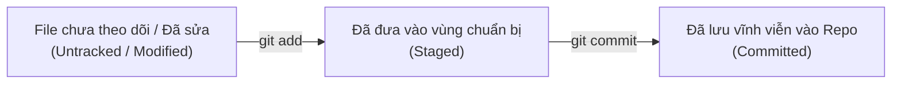
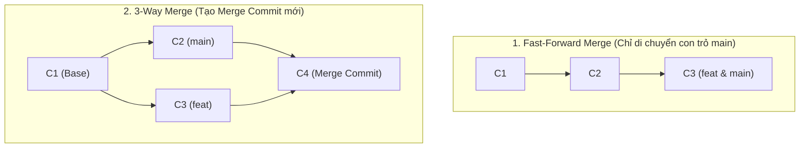

# Git: Bản Chất, Kiến Trúc và Thực Chiến

Tài liệu cẩm nang toàn diện về hệ thống quản lý phiên bản Git — từ việc thấu hiểu nỗi đau thực tế, giải mã kiến trúc dữ liệu cốt lõi bên dưới (`.git`), cho đến các thao tác thực chiến và quy chuẩn làm việc chuyên nghiệp.

---

## Mục lục

- [1. Đặt Vấn Đề: Nỗi Đau Trước Khi Có Git](#1-đặt-vấn-đề-nỗi-đau-trước-khi-có-git)
  - [1.1. Quản lý thủ công](#11-quản-lý-thủ-công---nỗi-đau-khi-làm-việc-cá-nhân)
  - [1.2. Xung đột nhóm](#12-xung-đột-nhóm---nỗi-đau-khi-làm-việc-tập-thể)
- [2. Giải Pháp & Triết Lý Thiết Kế](#2-giải-pháp--triết-lý-thiết-kế)
  - [2.1. Phân tán (DVCS) vs Tập trung (CVCS)](#21-phân-tán-dvcs-và-tập-trung-cvcs)
  - [2.2. Tư duy lưu trữ dữ liệu (Snapshot vs Diff)](#22-tư-duy-lưu-trữ-dữ-liệu-snapshot-vs-diff)
- [3. Kiến Trúc Cốt Lõi Của Git](#3-kiến-trúc-cốt-lõi-của-git)
  - [3.1. Ba vùng dữ liệu (3 Data Areas)](#31-ba-vùng-dữ-liệu)
  - [3.2. Bốn đối tượng cốt lõi trong `.git/objects`](#32-bốn-đối-tượng-cốt-lõi-trong-gitobjects)
  - [3.3. HEAD là gì? & Hiện tượng Detached HEAD](#33-head-là-gì)
  - [3.4. Cấu trúc DAG (Directed Acyclic Graph)](#34-cấu-trúc-đồ-thị-dag)
- [4. Giải Mã Bản Chất & Thao Tác Thực Chiến](#4-giải-mã-bản-chất--thao-tác-thực-chiến)
  - [4.1. Khởi tạo và sao chép (`init` / `clone`)](#41-khởi-tạo-và-sao-chép)
  - [4.2. Quản lý thay đổi (`status` / `add` / `commit` / `stash`)](#42-quản-lý-thay-đổi)
  - [4.3. Làm việc với nhánh (`branch` / `switch` / `merge` / `log` / `tag`)](#43-làm-việc-với-nhánh)
    - [4.3.1. Xử lý Conflict](#431-chú-ý-conflict-xảy-ra-khi-nào-và-cách-xử-lý)
    - [4.3.2. Phân biệt Fast-Forward Merge và 3-Way Merge](#432-phân-biệt-fast-forward-merge-và-3-way-merge)
  - [4.4. Đồng bộ từ xa (`remote` / `fetch` / `pull` / `push`)](#44-đồng-bộ-từ-xa)
  - [4.5. Bộ lệnh cứu nguy & Khôi phục (`restore` / `amend` / `reset` / `revert` / `reflog`)](#45-bộ-lệnh-cứu-nguy--khôi-phục)
- [5. Đánh Giá & Quy Tắc Sử Dụng](#5-đánh-giá--quy-tắc-sử-dụng)
  - [5.1. Ưu và nhược điểm của Git](#51-ưu--nhược-điểm-của-git)
  - [5.2. Quy tắc làm việc chuẩn trong nhóm (Best Practices)](#52-quy-tắc-làm-việc-chuẩn)

---

## 1. Đặt Vấn Đề: Nỗi Đau Trước Khi Có Git

### 1.1. Quản lý thủ công - Nỗi đau khi làm việc cá nhân

Trước khi có hệ thống quản lý phiên bản (Version Control System - VCS), lập trình viên thường lưu mã nguồn và tài liệu bằng cách copy-paste và đặt tên file:

```text
MyProject/
├── BaoCaoCuoiKy.docx
├── BaoCaoCuoiKy_v2.docx
├── BaoCaoCuoiKy_v2_sua.docx
├── BaoCaoCuoiKy_FINAL.docx
├── BaoCaoCuoiKy_FINAL_that.docx
└── BaoCaoCuoiKy_FINAL_gui_thay.docx
```

#### Các vấn đề phát sinh:

| Vấn đề | Hậu quả thực tế |
| :--- | :--- |
| **Không biết bản nào mới nhất, đúng nhất** | Mất thời gian đối chiếu từng dòng, dễ nộp/deploy nhầm bản cũ. |
| **Không có lịch sử thay đổi** | Không biết ai sửa gì, sửa khi nào, vì sao sửa. |
| **Không thể hoàn tác khi code mới bị lỗi** | Phải nhớ hoặc gõ lại bằng tay toàn bộ logic cũ. |
| **Backup thủ công (copy thư mục)** | Tốn dung lượng ổ đĩa, dễ quên sao lưu, dễ ghi đè nhầm làm mất code. |
| **Không tách biệt môi trường thử nghiệm và ổn định** | Một lỗi nhỏ khi thử tính năng mới có thể phá hỏng toàn bộ sản phẩm đang chạy. |

> [!NOTE]
> **Động lực ra đời của VCS:** Con người cần một **"Cỗ máy thời gian"** cho mã nguồn — tự động ghi nhận từng thay đổi, lưu trữ trạng thái minh bạch mà không cần can thiệp đặt tên file thủ công.

---

### 1.2. Xung đột nhóm - Nỗi đau khi làm việc tập thể

Khi nhiều người cùng làm chung một dự án mà không có công cụ quản lý phiên bản:

- **Ghi đè lẫn nhau:** Lập trình viên A và B cùng sửa file `main.py` rồi gửi qua Email/Zalo/Drive. Ai gửi sau sẽ đè lên người gửi trước $\rightarrow$ Mất sạch công sức của người kia.
- **Mất kiểm soát phân công:** Hai người vô tình cùng viết một chức năng dẫn đến code trùng lặp hoặc đối chọi logic.
- **Hợp nhất thủ công (Manual Merge) cực kỳ rủi ro:** Copy - paste bằng tay từng đoạn code khác nhau giữa 2 bản rất dễ sót logic hoặc phát sinh lỗi tiềm ẩn.
- **Thiếu "vùng đệm an toàn":** Một người đẩy code hỏng lên có thể làm sập ngay lập tức môi trường làm việc chung của cả đội ngũ.

$$\implies \text{Cần một hệ thống lưu lịch sử minh bạch, hỗ trợ làm việc song song không giẫm chân nhau. Đó là lý do Git ra đời!}$$

---

## 2. Giải Pháp & Triết Lý Thiết Kế

### 2.1. Phân tán (DVCS) và Tập trung (CVCS)



- **CVCS (Centralized Version Control System - SVN, Perforce):**
  - Chỉ máy chủ trung tâm (Central Server) giữ toàn bộ lịch sử phiên bản.
  - Máy cá nhân chỉ giữ bản mới nhất (*working copy*).
  - Mọi thao tác xem lịch sử, commit đều bắt buộc phải có kết nối mạng tới server.
  - **Điểm chết duy nhất (Single Point of Failure):** Nếu server bị sập hoặc hỏng ổ cứng $\rightarrow$ Toàn bộ dự án và lịch sử biến mất.

- **DVCS (Distributed Version Control System - Git, Mercurial):**
  - Mỗi máy của mỗi thành viên đều sở hữu một bản sao đầy đủ (**full copy**) của toàn bộ kho lưu trữ và lịch sử.
  - Mọi thao tác commit, tạo nhánh, tra cứu log đều diễn ra trên máy cục bộ với tốc độ cực nhanh và làm việc offline hoàn toàn.
  - Server (GitHub, GitLab, Bitbucket) đóng vai trò là nơi trung chuyển đồng bộ, không phải nơi nắm giữ độc quyền dữ liệu.

#### Bảng so sánh CVCS vs DVCS:

| Tiêu chí | CVCS (SVN, CVS) | DVCS (Git, Mercurial) |
| :--- | :--- | :--- |
| **Nơi lưu lịch sử** | Chỉ tại Server trung tâm | Nhân bản đầy đủ tại tất cả máy trạm |
| **Làm việc Offline** | Không | Có |
| **Tốc độ Commit / Log** | Chậm (chờ đường truyền mạng) | Siêu nhanh (thao tác trực tiếp trên ổ cứng) |
| **Rủi ro mất dữ liệu** | Cao (nếu server hỏng) | Thấp (mỗi máy là một bản backup) |
| **Độ phức tạp Branching** | Cồng kềnh, tốn tài nguyên server | Siêu nhẹ, chỉ là việc di chuyển con trỏ |

---

### 2.2. Tư duy lưu trữ dữ liệu (Snapshot vs Diff)

```text
Cách nghĩ SAI (Diff-based - Deltas):
Version 1: [ File A ]  [ File B ]  [ File C ]
Version 2: [ Diff A1]               [ Diff C1]
Version 3:             [ Diff B1]   [ Diff C2]

Cách Git THỰC SỰ hoạt động (Snapshot-based):
Commit 1:  [ File A1 ] ── [ File B1 ] ── [ File C1 ]
                 │              │              ▲
Commit 2:  [ File A2 ] ── [ Link B1 ] ── [ File C2 ]
                 │              │              ▲
Commit 3:  [ Link A2 ] ── [ File B2 ] ── [ Link C2 ]
```

> [!IMPORTANT]
> - **Cách nghĩ SAI:** Git lưu từng dòng chênh lệch (diff / delta) qua từng commit (Ví dụ: *"commit này chỉ lưu: dòng 5 sửa từ A thành B"*).
> - **Cách Git thực sự hoạt động:** Mỗi lần commit, Git chụp lại **toàn bộ ảnh chụp trạng thái (Snapshot)** của tất cả các file trong dự án tại thời điểm đó.
>
> **Cơ chế tối ưu hóa dung lượng của Git:**
> - **File KHÔNG đổi:** Git không copy lại nội dung mà chỉ tạo một con trỏ (link) tham chiếu tới file đã lưu trữ ở commit trước đó.
> - **File CÓ đổi:** Git nén và lưu bản snapshot mới của riêng file đó.

---

## 3. Kiến Trúc Cốt Lõi Của Git

### 3.1. Ba vùng dữ liệu

Mã nguồn trong Git luôn luân chuyển qua 3 trạng thái và 3 vùng dữ liệu riêng biệt:



| Vùng dữ liệu | Bản chất & Vai trò | Lệnh tương tác chính |
| :--- | :--- | :--- |
| **Working Directory** | Thư mục chứa mã nguồn thực tế mà bạn đang xem, tạo, sửa bằng IDE/Editor (như mặt bàn làm việc). | `git status` (xem file thay đổi) |
| **Staging Area (Index)** | Vùng đệm trung gian — nơi bạn chọn lọc chính xác các file/dòng code cần đưa vào bức ảnh chụp tiếp theo. | `git add <file>` |
| **Repository (`.git`)** | Kho lưu trữ chính thức, an toàn và vĩnh viễn chứa toàn bộ đồ thị commit và đối tượng của dự án. | `git commit -m "..."` |

---

### 3.2. Bốn đối tượng cốt lõi trong `.git/objects`

Tất cả mọi thứ trong Git (tệp, thư mục, phiên bản, nhãn) đều được mã hóa bằng thuật toán băm SHA-1 (chuỗi 40 ký tự hexa) và lưu trữ dưới dạng 1 trong 4 đối tượng sau:



| Đối tượng | Vai trò cốt lõi | Ví dụ hình tượng dễ hiểu |
| :--- | :--- | :--- |
| **Blob** *(Binary Large Object)* | Lưu **nội dung thuần túy** của 1 file (không lưu tên file, không lưu quyền thực thi). | Tờ giấy chỉ chứa chữ, không ghi tiêu đề. |
| **Tree** | Lưu **cấu trúc thư mục** — danh sách ánh xạ tên file/thư mục tới SHA-1 của Blob hoặc Tree con tương ứng. | Trang mục lục ghi *"Trang giấy nội dung X mang tên main.py, nằm trong thư mục src"*. |
| **Commit** | Một bức ảnh chụp toàn cảnh: trỏ tới 1 Tree gốc, kèm tác giả, người commit, thời gian, mô tả và SHA-1 của Commit cha (*parent*). | Bức ảnh chụp toàn cảnh + nhãn ghi chú ngày chụp, người chụp, và trỏ về bức ảnh trước đó. |
| **Tag** | Một con trỏ đặt tên cố định, không di chuyển, gắn vào một commit cụ thể (thường dùng đánh dấu phiên bản phát hành). | Nhãn dán `v1.0.0` dán chặt lên một tấm ảnh nhất định. |

---

### 3.3. HEAD là gì?

> [!TIP]
> **HEAD** là một **con trỏ đặc biệt**, luôn chỉ vào commit (hoặc nhánh) mà bạn hiện đang đứng và làm việc trực tiếp tại đó.
>
> *Ví dụ:* Nếu các commit là các bức ảnh nối tiếp nhau trên cuộn phim, thì **HEAD** chính là ngón tay của bạn đang chỉ vào tấm ảnh nào trên cuộn phim ấy.



- **Trạng thái thông thường:** `HEAD` trỏ vào một nhánh (Ví dụ: `main`), và nhánh đó lại trỏ vào commit mới nhất của nhánh. Khi bạn commit mới, cả nhánh và HEAD cùng tự động dịch chuyển về phía trước.
- **Trạng thái `Detached HEAD`:** Xảy ra khi bạn checkout trực tiếp vào một mã băm commit (`git checkout <commit-hash>`). Lúc này HEAD tách rời khỏi mọi nhánh. Các commit mới tạo ra ở trạng thái này sẽ bị "mồ côi" và có thể bị bộ gom rác (*Garbage Collector*) của Git dọn sạch nếu không tạo branch mới để giữ lại.

---

### 3.4. Cấu trúc đồ thị DAG

Lịch sử của Git không phải là một danh sách phẳng đơn thuần, mà là một **Đồ thị có hướng không chu trình (Directed Acyclic Graph - DAG)**:



- **Có hướng (Directed):** Mỗi commit chỉ biết và trỏ ngược về (các) commit cha của nó, không trỏ tới tương lai.
- **Không chu trình (Acyclic):** Lịch sử chỉ đi một chiều về quá khứ, không bao giờ vòng lại chính nó (không có commit nào vừa là con vừa là tổ tiên của một commit khác).
- **Phân nhánh siêu nhẹ:** Một nhánh (*branch*) trong Git không phải là một bản sao chép thư mục nặng nề; nó đơn giản là một **tệp văn bản nhỏ chứa 41 bytes** (40 ký tự SHA-1 + dấu xuống dòng) trỏ tới đỉnh của đồ thị DAG.

---

## 4. Giải Mã Bản Chất & Thao Tác Thực Chiến

### 4.1. Khởi tạo và sao chép

```bash
# Biến thư mục hiện tại thành một Git repository (tạo thư mục ẩn .git)
git init

# Sao chép toàn bộ repository (kèm đầy đủ lịch sử, commit, branch) từ server về máy
git clone <url-repository>
```

---

### 4.2. Quản lý thay đổi



| Lệnh | Chức năng & Bản chất | Cú pháp ví dụ |
| :--- | :--- | :--- |
| `git status` | Kiểm tra trạng thái hiện tại của Working Directory và Staging Area. | `git status` |
| `git add` | Đưa nội dung file vào Staging Area, tạo các Blob object tương ứng trong `.git/objects`. | `git add main.py`<br>`git add .` *(thêm toàn bộ)* |
| `git commit` | Đóng gói Staging Area thành một Commit Snapshot vĩnh viễn kèm thông điệp. | `git commit -m "feat: thêm api đăng nhập"` |
| `git stash` | "Cất tạm" các thay đổi chưa commit vào ngăn kéo bộ nhớ tạm để Working Directory sạch sẽ. | `git stash` *(cất đi)*<br>`git stash pop` *(lấy lại)* |

---

### 4.3. Làm việc với nhánh

```bash
# Liệt kê tất cả các nhánh cục bộ hiện có
git branch

# Tạo nhánh mới có tên feature-login (chỉ tạo con trỏ, chưa chuyển sang)
git branch feature-login

# Chuyển sang nhánh khác (Cách mới, rõ nghĩa và khuyến nghị)
git switch feature-login
# Hoặc lệnh truyền thống:
git checkout feature-login

# Tạo nhánh mới VÀ chuyển sang nhánh đó ngay lập tức
git switch -c feature-dashboard
# Hoặc: git checkout -b feature-dashboard

# Hợp nhất nhánh khác vào nhánh hiện tại
git merge feature-login

# Xem lịch sử commit trực quan dưới dạng cây
git log --oneline --graph --decorate --all

# Đặt nhãn phiên bản cố định cho commit hiện tại
git tag -a v1.0.0 -m "Release version 1.0.0"
```

---

#### 4.3.1. Chú ý: Conflict xảy ra khi nào và cách xử lý?

> [!WARNING]
> **Conflict (Xung đột mã nguồn)** xảy ra khi 2 nhánh cùng sửa đổi các dòng code giống nhau hoặc cùng vị trí trong 1 file. Git không thể tự quyết định logic nào đúng và sẽ dừng quá trình merge để yêu cầu lập trình viên can thiệp.

##### Dấu hiệu nhận biết Conflict trong File:

```python
<<<<<<< HEAD
# Đoạn code đang có ở nhánh hiện tại (nhánh bạn đang đứng)
def get_discount():
    return 0.10
=======
# Đoạn code ở nhánh đang được gộp vào
def get_discount():
    return 0.15
>>>>>>> feature-discount
```

##### Quy trình 4 bước xử lý Conflict trên VS Code:

| Bước | Thao tác thực hiện | Chi tiết |
| :---: | :--- | :--- |
| **1** | **Mở file xung đột** | Tìm các đoạn mã được kẹp giữa `<<<<<<< HEAD`, `=======` và `>>>>>>>`. |
| **2** | **Chọn phương án gộp** | Sử dụng các nút bấm nhanh (Inline Actions) của VS Code:<br>• **Accept Current Change:** Giữ code nhánh hiện tại (`HEAD`).<br>• **Accept Incoming Change:** Lấy code nhánh đang merge vào.<br>• **Accept Both Changes:** Giữ cả hai đoạn code.<br>• Hoặc tự sửa tay đoạn code theo đúng logic mong muốn. |
| **3** | **Lưu và Stage file** | Bấm `Ctrl + S`, sau đó chạy `git add <file>` (hoặc bấm dấu `+` ở tab Source Control). |
| **4** | **Hoàn tất Commit** | Chạy `git commit` (Git sẽ tự tạo sẵn message giải quyết conflict). |

---

#### 4.3.2. Phân biệt Fast-Forward Merge và 3-Way Merge



- **Fast-Forward Merge:**
  - Xảy ra khi nhánh chính (`main`) **chưa có commit mới nào** kể từ lúc bạn tách nhánh con.
  - **Bản chất:** Git chỉ việc dời con trỏ `main` tiến thẳng tới commit mới nhất của nhánh con.
  - Không tạo thêm commit merge, không bao giờ phát sinh conflict.
- **3-Way Merge:**
  - Xảy ra khi cả 2 nhánh đều có các commit mới phát triển độc lập song song.
  - **Bản chất:** Git so sánh 3 điểm: Commit đỉnh nhánh A + Commit đỉnh nhánh B + Commit gốc chung gần nhất (*Common Ancestor/Base*).
  - Git tự động tạo một **Merge Commit mới có 2 commit cha**. Đây là trường hợp có thể xuất hiện Conflict.

---

### 4.4. Đồng bộ từ xa

```bash
# Xem danh sách các remote server đang liên kết
git remote -v

# Tải dữ liệu mới nhất từ server về nhưng CHƯA gộp vào code hiện tại (An toàn)
git fetch origin

# Tải về VÀ tự động gộp ngay vào nhánh hiện tại (= git fetch + git merge)
git pull origin main

# Đẩy các commit cục bộ lên remote server để chia sẻ với team
git push origin feature-login
```

---

### 4.5. Bộ lệnh "Cứu Nguy" & Khôi Phục

```mermaid
flowchart TD
    subgraph MucDo1 ["1. Đang ở Working Directory"]
        WD1["File bị sửa sai"] -->|git restore file| WD2["Khôi phục về trạng thái commit cũ"]
    end

    subgraph MucDo2 ["2. Đã lỡ đưa vào Staging Area"]
        SA1["File đã git add"] -->|git restore --staged file| SA2["Đưa file về lại Working Directory"]
    end

    subgraph MucDo3 ["3. Đã tạo Commit cục bộ (chưa push)"]
        C1["Commit vừa tạo"] -->|git reset --soft HEAD~1| C2["Lùi 1 commit, giữ nguyên code ở Staging"]
    end

    subgraph MucDo4 ["4. Đã push Commit lên Server dùng chung"]
        R1["Commit lỗi trên Server"] -->|git revert hash| R2["Tạo commit mới đảo ngược thay đổi (An toàn)"]
    end
```



| Tình huống sự cố | Lệnh xử lý | Bản chất bên dưới | Mức độ an toàn |
| :--- | :--- | :--- | :--- |
| **Sửa file linh tinh ở Working Directory, muốn quay lại ban đầu** | `git restore <file>` | Lấy lại nội dung file từ commit gần nhất đè lên Working Directory. | Mất thay đổi chưa add |
| **Lỡ `git add` nhầm file bí mật (.env, build)** | `git restore --staged <file>` | Đưa file từ Staging Area quay lại Working Directory, không làm mất nội dung file. | An toàn |
| **Commit xong mới nhớ quên 1 file hoặc ghi sai message** | `git commit --amend` | Gộp thay đổi mới vào commit gần nhất, thay thế commit cũ bằng commit mới. | An toàn (nếu chưa push) |
| **Muốn hủy 1 commit vừa tạo (chưa push lên server)** | `git reset --soft HEAD~1` | Lùi HEAD 1 commit, giữ nguyên toàn bộ code đã sửa trong Staging Area. | An toàn |
| **Muốn hủy bỏ commit ĐÃ PUSH lên server dùng chung** | `git revert <commit-hash>` | Tạo một commit MỚI có nội dung đảo ngược hoàn toàn commit cũ. Giữ nguyên lịch sử cho team. | An toàn (chuẩn cho nhóm) |
| **Lỡ tay chạy `reset --hard` làm mất commit** | `git reflog`<br>sau đó `git checkout <hash>` | Tra cứu lại "nhật ký di chuyển" của con trỏ HEAD. Mọi commit đã tạo hầu như không bao giờ mất trong Git. | Khôi phục tối thượng |

---

## 5. Đánh Giá & Quy Tắc Sử Dụng

### 5.1. Ưu & Nhược điểm của Git

#### Ưu điểm:
1. **Tốc độ vượt trội:** Hầu hết thao tác (commit, diff, log, branch) thực thi tức thì trên đĩa cứng cục bộ.
2. **Bảo mật và an toàn dữ liệu cao:** Mỗi máy trạm là một bản sao lưu toàn vẹn; tính toàn vẹn được đảm bảo bằng hàm băm mật mã SHA.
3. **Mô hình phân nhánh linh hoạt:** Khuyến khích tạo các nhánh ngắn hạn (*feature branches*) để phát triển song song không gây gián đoạn.
4. **Hệ sinh thái khổng lồ:** Tích hợp tiêu chuẩn trên GitHub, GitLab, Bitbucket và toàn bộ quy trình CI/CD hiện đại.
5. **Mã nguồn mở và hoàn toàn miễn phí.**

#### Nhược điểm:
1. **Đường cong tiếp thu dốc (Steep Learning Curve):** Khá nhiều thuật ngữ trừu tượng (Staging, HEAD, Index, Rebase, Reflog...).
2. **Xử lý file nhị phân lớn kém hiệu quả:** Không tối ưu cho video, ảnh dung lượng cao hoặc file asset game (cần giải pháp mở rộng như *Git LFS*).
3. **Lịch sử dễ bị rối loạn:** Nếu nhóm không tuân thủ quy chuẩn branching và merge, đồ thị commit sẽ trở thành "mạng nhện".
4. **Rủi ro khi dùng lệnh hủy diệt:** Dùng sai các lệnh cưỡng bức như `git push --force` hay `git reset --hard` có thể làm mất dữ liệu của đồng đội.

---

### 5.2. Quy tắc làm việc chuẩn

> [!CAUTION]
> Tuân thủ các nguyên tắc sau để giữ kho mã nguồn của đội ngũ luôn sạch sẽ, minh bạch và an toàn:

1. **Tuyệt đối không commit trực tiếp vào nhánh `main`/`master`:**
   - Luôn tạo nhánh riêng theo quy ước: `feature/ten-tinh-nang`, `fix/ten-loi`, `hotfix/loi-khan-cap`.
2. **Commit nhỏ, nguyên tử (Atomic Commit) và viết message có ý nghĩa:**
   - Mỗi commit chỉ nên giải quyết trọn vẹn một vấn đề logic.
   - Message mô tả rõ **Lý do sửa** thay vì chỉ nói *Sửa cái gì*.
   - *Nên viết:* `fix(auth): sửa lỗi crash khi người dùng nhập mật khẩu rỗng`
   - *Không nên viết:* `update`, `fix bug`, `code moi`, `abc`
3. **Khai thác tệp `.gitignore` triệt để:**
   - Không bao giờ commit file phụ thuộc (`node_modules/`, `venv/`), file build (`dist/`, `build/`, `*.exe`), hoặc file cấu hình nhạy cảm chứa secret key (`.env`).
4. **Luôn `fetch`/`pull` trước khi bắt đầu làm việc và trước khi `push`:**
   - Cập nhật code mới nhất từ đồng đội về máy để xử lý xung đột từ sớm.
5. **Đưa mã nguồn qua Pull Request (PR) / Merge Request (MR):**
   - Không tự ý gộp code vào nhánh chính khi chưa có sự rà soát (*Code Review*) của ít nhất một thành viên trong nhóm.
6. **Nói KHÔNG với `git push --force` trên các nhánh dùng chung:**
   - Lệnh này viết đè lịch sử trên remote, có thể xóa sạch commit của người khác mà không có cảnh báo.

---

<div align="center">
  <sub>Tài liệu được biên soạn phục vụ đào tạo nội bộ và chuẩn hóa quy trình phát triển phần mềm.</sub>
</div>
