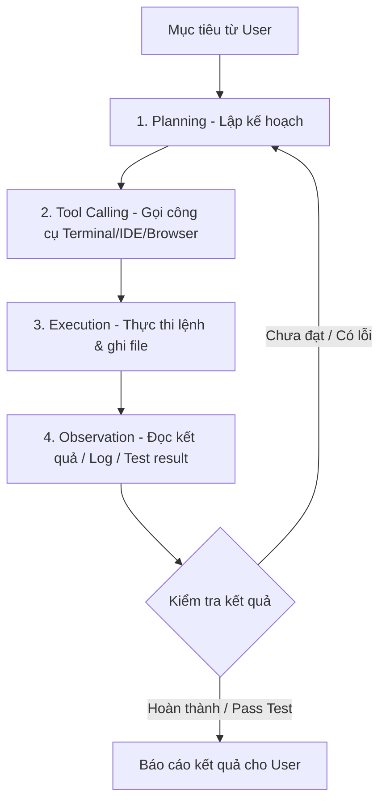

# Tài Liệu Chia Sẻ: Thực Trạng Sử Dụng AI & Sức Mạnh Của AI Agent (Antigravity)

> **Mục tiêu:** Tài liệu trình bày và thảo luận dành cho buổi chia sẻ nội bộ về xu hướng chuyển dịch từ Chatbot truyền thống sang AI Agent, cách khai thác tối đa hiệu quả của AI Agent và giải mã các thuật ngữ kỹ thuật cốt lõi.

---

## 1. Thực Trạng Sử Dụng AI Hiện Tại & Những "Nỗi Đau" Thường Gặp

### Thực trạng
Hầu hết người dùng phần mềm và lập trình viên hiện nay đang dừng lại ở việc tương tác với AI dưới dạng **Chatbot hội thoại** (ChatGPT, Claude web, Gemini web). Các tác vụ chính bao gồm:
* Hỏi đáp lý thuyết, tra cứu tài liệu nhanh.
* Viết email, soạn thảo văn bản.
* Tóm tắt tài liệu hoặc sinh các đoạn mã nguồn (code) ngắn, rời rạc.

### Những "Nỗi đau" (Pain Points) khi dùng Chatbot truyền thống

> [!WARNING]
> **Giới hạn của Chatbot:** Chatbot giống như một "Cố vấn nói hay nhưng không có tay chân" — đưa ra giải pháp lý thuyết nhưng để lại toàn bộ khâu thực thi cho con người.

```
+-------------------+      Gửi Prompt      +-------------------+
|                   | -------------------> |                   |
|                   |                      |      Chatbot      |
|                   | <------------------- |  (ChatGPT/Claude) |
|     User (Dev)    |      Trả về Text     +-------------------+
|                   |
|  - Copy code      |
|  - Paste vào IDE  |
|  - Chạy thử       |
|  - Đọc log lỗi    |
|  - Chụp ảnh log   |
+-------------------+
```

1. **Thiếu khả năng hành động (No Execution):**
   * AI chỉ sinh ra lời khuyên hoặc đoạn code dưới dạng văn bản (text/markdown).
   * Người dùng phải tự copy-paste, tích hợp vào dự án, cấu hình môi trường, chạy thử và phát hiện lỗi thủ công.

2. **Mất ngữ cảnh liên tục (Context Loss):**
   * Khi làm việc trên dự án lớn có hàng trăm file code, thông tin vượt quá dung lượng trí nhớ của một phiên chat.
   * AI nhanh chóng quên các quyết định kiến trúc, tiêu chuẩn code hoặc các cuộc thảo luận thiết kế ban đầu.

3. **Ảo giác và tự bịa (Hallucination):**
   * AI tự sinh ra các hàm/thư viện không tồn tại, cú pháp đã lỗi thời (deprecated), hoặc logic sai lầm nhưng được trình bày rất tự tin và thuyết phục.

4. **Không thể tự sửa sai (Inability to Auto-debug):**
   * Khi code gặp lỗi runtime hay testcase thất bại, AI không có cách nào tự đọc log hay kiểm tra môi trường.
   * Người dùng phải quay lại hộp chat, chép log lỗi gửi cho AI để xin giải pháp mới, gây đứt gãy luồng làm việc.

---

## 2. AI Agent Antigravity & So Sánh Với Chatbot Truyền Thống

### Định nghĩa AI Agent & Google Antigravity

* **AI Agent là gì?**  
  Là một hệ thống AI không chỉ dừng lại ở việc phản hồi hội thoại, mà sở hữu khả năng **Lập kế hoạch (Planning)**, **Sử dụng công cụ (Tools/APIs)** và **Tự động thực thi tác vụ lặp đi lặp lại** trong một môi trường cụ thể (Terminal, IDE, Browser) để hoàn thành mục tiêu được giao.

* **Google Antigravity là gì?**  
  Là nền tảng AI Agent thế hệ mới tập trung vào **quy trình kỹ thuật phần mềm (Software Engineering Lifecycle)**. Antigravity cho phép AI trực tiếp tương tác với môi trường thực (File system, Terminal, Git, Browser, Runner) để tự động xây dựng, kiểm thử, debug và vận hành mã nguồn.

### Luồng hoạt động của AI Agent (Antigravity Loop)



### Bảng so sánh chi tiết

| Tiêu chí | Chatbot thông thường (ChatGPT, Claude web) | AI Agent (Antigravity) |
| :--- | :--- | :--- |
| **Mục tiêu chính** | Trả lời câu hỏi, tạo văn bản, gợi ý code | Hoàn thành mục tiêu/nhiệm vụ kỹ thuật (Task-oriented) |
| **Vòng lặp tương tác** | Single-turn hoặc Multi-turn hỏi đáp | Tự động lặp: *Nghĩ $\rightarrow$ Gọi tool $\rightarrow$ Đọc kết quả $\rightarrow$ Sửa sai* |
| **Môi trường hoạt động** | Hộp chat đóng, chỉ sinh text/markdown | Quyền truy cập trực tiếp Terminal, File System, Git, API, Browser |
| **Khả năng tự sửa lỗi** | Phụ thuộc hoàn toàn vào prompt sửa lỗi của người dùng | Tự chạy build/test, phát hiện lỗi log và tự chỉnh sửa code đến khi pass |
| **Khả năng giữ ngữ cảnh** | Giới hạn theo phiên chat hiện tại | Truy cập và index toàn bộ Workspace/Codebase |

---

## 3. Phương Pháp Sử Dụng AI Agent Hiệu Quả

Để tối ưu hóa năng suất với AI Agent, áp dụng 4 chiến lược cốt lõi sau:

> [!TIP]
> **Tư duy thay đổi:** Chuyển từ tư duy *"Cầm tay chỉ việc cho AI từng bước"* sang tư duy *"Quản lý và giao việc cho một Junior Developer tài năng"*.

### 1. Giao mục tiêu thay vì giao từng bước (Goal-Oriented Prompting)
* **Sai:** *"Viết cho tôi một hàm xử lý order bằng Node.js."*
* **Đúng:** Định nghĩa rõ **Input**, **Output mong muốn** và các **Ràng buộc (Constraints)**.
  > *"Tạo endpoint REST `POST /orders`, validate request body bằng Schema Z, lưu vào Database Y, xử lý ngoại lệ khi thiếu hàng, và viết unit test đạt coverage > 80%."*

### 2. Cung cấp công cụ và phạm vi truy cập rõ ràng (Tools & Scope Control)
* Cấp quyền hợp lý cho Agent sử dụng các câu lệnh cụ thể (ví dụ: `npm test`, `pytest`, `eslint`, `git status`).
* Khoanh vùng thư mục làm việc (Workspace boundaries) để đảm bảo Agent không can thiệp vào các file cấu hình nhạy cảm hoặc sửa đổi ngoài phạm vi yêu cầu.

### 3. Quy trình Con người kiểm duyệt (Human-in-the-Loop - HITL)
* Cho phép Agent hoạt động tự do ở các khâu: khảo sát mã nguồn, lập bản nháp, sinh unit test, và sửa lỗi nhỏ.
* Giữ quyền phê duyệt ở các cột mốc quan trọng: **Review kế hoạch (Implementation Plan)** trước khi thực thi và **Review Diff/Commit** trước khi đẩy code lên nhánh chính.

### 4. Chia nhỏ bài toán lớn (Task Decomposition)
* Với các tính năng phức tạp hoặc tái cấu trúc (Refactoring) hệ thống lớn:
  1. Yêu cầu Agent phân tích và lập checklist các bước thực hiện.
  2. Xác nhận và duyệt kế hoạch tổng thể.
  3. Để Agent lần lượt thực thi và nghiệm thu từng bước nhỏ.

---

## 4. Giải Mã Các Thuật Ngữ Kỹ Thuật Cốt Lõi

| Thuật ngữ | Khái niệm & Ý nghĩa kỹ thuật |
| :--- | :--- |
| **Token** | Đơn vị cơ bản mà mô hình LLM xử lý (1 token $\approx$ 0.75 từ tiếng Anh hoặc 1 ký tự tiếng Việt có dấu). Mọi giới hạn bộ nhớ, tốc độ xử lý và chi phí API đều được tính dựa trên số lượng Token. |
| **Context Window** *(Cửa sổ ngữ cảnh)* | Dung lượng token tối đa mà mô hình có thể đọc, hiểu và ghi nhớ trong một lần suy luận (bao gồm System Prompt, Lịch sử chat, các File đính kèm và Output sinh ra). |
| **Session** *(Phiên làm việc)* | Một luồng tương tác liên tục từ lúc bắt đầu tác vụ đến khi hoàn thành; duy trì bộ nhớ cục bộ, trạng thái biến và lịch sử lệnh của lượt làm việc đó. |
| **Rule** *(Quy tắc / System Instruction)* | Các chỉ dẫn cứng đặt ở cấp hệ thống (ví dụ: file `.cursorrules`, `AGENTS.md`) buộc AI tuân thủ phong cách lập trình, quy chuẩn đặt tên, kiến trúc dự án hoặc các giới hạn an toàn. |
| **Skill / Tool Calling** | Khả năng AI nhận biết tình huống và tự động gọi các công cụ/hàm bên ngoài (chạy lệnh bash, truy vấn DB, đọc file, duyệt web) để lấy dữ liệu thực tế thay vì tự suy đoán. |
| **Ảo giác** *(Hallucination)* | Hiện tượng mô hình AI sinh ra thông tin sai sự thật, tự bịa hàm/API không tồn tại nhưng trình bày với văn phong cực kỳ tự tin do bản chất suy đoán xác suất từ tiếp theo. |
| **Ảo ngữ cảnh** *(Context Drift / Poisoning)* | Hiện tượng cửa sổ ngữ cảnh bị tích tụ quá nhiều thông tin rác, lịch sử thử-sai cũ hoặc mã lỗi lặp đi lặp lại, khiến AI bị "nhiễu" và liên tục đưa ra giải pháp sai dây chuyền. |
| **Long Context Retrieval** | Khả năng định vị và tìm kiếm chính xác thông tin chi tiết nằm trong tập dữ liệu siêu lớn (hàng triệu token, toàn bộ codebase) mà không bị bỏ sót (bài toán "Kim trong bọc" / *Needle in a Haystack*). |

---

## 5. Minh Họa Case Studies Từ Dự Án Thực Tế (Đề xuất lồng ghép Slide)

> [!NOTE]
> Bạn có thể đưa các kịch bản thực tế từ dự án của team vào slide theo mẫu cấu trúc dưới đây để buổi chia sẻ trực quan và thuyết phục hơn:

### Case Study 1: Tự Động Hóa End-to-End Tính Năng Mới
* **Bài toán:** Xây dựng tính năng Export báo cáo dữ liệu ra file Excel/PDF.
* **Cách Chatbot xử lý:** Gợi ý mã nguồn mẫu `exceljs`, dev tự cài thư viện, tự viết controller, tự test và sửa lỗi format.
* **Cách AI Agent (Antigravity) xử lý:**
  1. Agent đọc schema DB hiện tại và gợi ý file DTO.
  2. Agent cài đặt package `exceljs` qua Terminal.
  3. Agent tạo Service, Controller và Router.
  4. Agent tự chạy `npm test`, phát hiện lỗi async/await và tự sửa.
  5. Agent khởi chạy server, dùng Browser subagent để test download file trực tiếp.

### Case Study 2: Tự Động Debug & Refactor Legacy Code
* **Bài toán:** Hàm tính toán giảm giá bị dính lỗi đếm sai số lượng (Edge case) khi coupon hết hạn.
* **Cách AI Agent xử lý:**
  1. Yêu cầu Agent chạy bộ test hiện tại: `npm run test:unit`.
  2. Agent đọc stack trace lỗi, tìm đến vị trí file code nguồn.
  3. Agent tái hiện lỗi bằng cách thêm 1 testcase mới đại diện cho edge case.
  4. Agent sửa code logic trong file chính cho tới khi **toàn bộ testcase (cũ + mới) đều PASS**.
