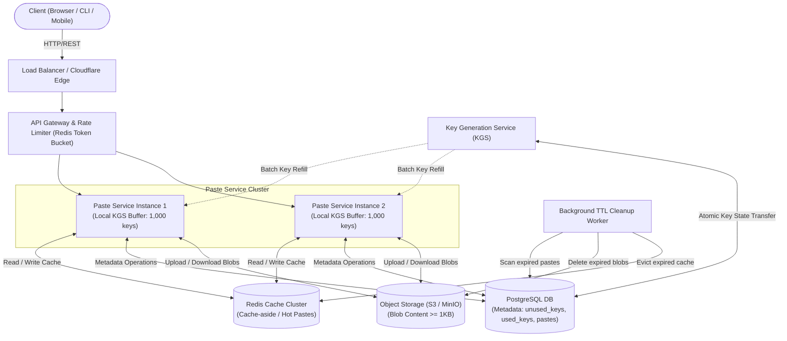

# Thiết Kế Kiến Trúc Hệ Thống: Pastebin & Short URL Service

> **Phiên bản**: 1.0.0  
> **Lĩnh vực**: Distributed Systems & High-Scale Web Architecture  
> **Mục tiêu**: Thiết kế hệ thống lưu trữ và chia sẻ đoạn mã / văn bản trực tuyến (Pastebin) với khả năng chịu tải cao, độ trễ thấp, tính bất biến của dữ liệu và sinh khóa định danh duy nhất (Short Key Generation Service - KGS).

---

## 1. Yêu Cầu & Phạm Vi Hệ Thống (Requirements & Scope)

### 1.1. Yêu Cầu Chức Năng (Functional Requirements)
- **Tạo paste**: Người dùng nhập nội dung văn bản/code, chọn ngôn ngữ lập trình, chọn thời gian hết hạn (TTL), chọn chế độ riêng tư (Public hoặc Private + Password), bấm "Save" → Hệ thống trả về Short URL và `delete_token`.
- **Xem paste**: Bất kỳ ai có liên kết (Short URL) đều xem được nội dung (nếu là Private thì cần nhập đúng password).
- **Xóa / Hết hạn paste**: 
  - *Xóa thủ công*: Người tạo xóa chủ động bằng `delete_token`.
  - *Tự động hết hạn*: Hệ thống tự động dọn dẹp theo thời gian sống (TTL) đã thiết lập khi tạo.

### 1.2. Yêu Cầu Phi Chức Năng (Non-Functional Requirements)
- **Reliability & Availability (Độ tin cậy & Tính sẵn sàng)**: Hệ thống không bị gián đoạn hay sập khi traffic đọc tăng đột biến (ví dụ: một paste chứa code/thông tin bị share viral).
- **Low Latency (Độ trễ thấp)**: Cả đọc và ghi đều phải cực nhanh:
  - Ghi (Write Path): `p99 < 200ms`
  - Đọc (Read Path): `p99 < 100ms` (với Redis Cache hit `< 10ms`)
- **Uniqueness & Non-predictability (Tính duy nhất & Khó đoán)**: Short key sinh ra phải duy nhất tuyệt đối và khó đoán để chống tấn công quét dữ liệu hàng loạt (Enumeration / Brute-force Attack).
- **Scalability (Khả năng mở rộng)**: Mở rộng ngang (Horizontal Scaling) linh hoạt khi lưu lượng truy cập hoặc nhu cầu lưu trữ tăng trưởng đột biến.
- **Security & Rate Limiting (Bảo mật & Giới hạn tần suất)**: Chống spam tạo paste hàng loạt và tấn công từ chối dịch vụ (DDoS) bằng thuật toán Rate Limiting (Token Bucket) giới hạn theo IP và User ID.

### 1.3. Ngoài Phạm Vi Bản Thiết Kế v1 (Out of Scope)
- Hệ thống tài khoản người dùng đầy đủ (Login, OAuth, SSO) — chỉ dùng `user_id` tùy chọn, người dùng ẩn danh (Anonymous) vẫn tạo được paste bình thường.
- Chỉnh sửa paste sau khi tạo (**Paste là bất biến / Immutable**).
- Analytics chi tiết (Real-time view count, thống kê dashboard tương tác).
- Tìm kiếm toàn văn (Full-text search) giữa các paste.
- CDN toàn cầu / Multi-region Active-Active (hướng mở rộng cho các phiên bản tiếp theo).

---

## 2. Ước Lượng Quy Mô & Tải Trọng (Capacity Estimation)

### 2.1. Giả Định Hệ Thống
- **DAU (Daily Active Users)**: 1,000,000 người dùng hoạt động hàng ngày.
- **Tỷ lệ tạo paste**: Trung bình 1 paste / 10 người dùng / ngày → `100,000 paste mới / ngày`.
- **Tỷ lệ Đọc : Ghi (Read-to-Write Ratio)**: `≈ 10 : 1` (Đặc thù Pastebin: viết 1 lần, đọc nhiều lần khi chia sẻ liên kết).
- **Kích thước trung bình 1 paste**: `10 KB`.
- **Kích thước 1 dòng Metadata**: `~500 Bytes / paste`.
- **Thời gian lưu trữ trung bình**: Phần lớn paste tồn tại `~30 ngày` trước khi hết hạn hoặc bị xóa.

### 2.2. Ước Lượng QPS (Queries Per Second)
- **Ghi (Write QPS)**:
  - Trung bình: $\frac{100,000}{86,400\text{ s}} \approx 1.2\text{ QPS}$
  - Peak (x10 lưu lượng): $\approx 12\text{ QPS}$
- **Đọc (Read QPS)**:
  - Trung bình: $\frac{1,000,000}{86,400\text{ s}} \approx 11.6\text{ QPS}$
  - Peak (x10 lưu lượng): $\approx 116\text{ QPS}$

### 2.3. Ước Lượng Dung Lượng Lưu Trữ (Storage Estimation)
- **Content mới mỗi ngày**: $100,000 \times 10\text{ KB} \approx 1\text{ GB / ngày}$.
- **Metadata mới mỗi ngày**: $100,000 \times 500\text{ B} \approx 50\text{ MB / ngày}$.
- **Storage tích lũy nếu không dọn dẹp**: $\approx 365\text{ GB / năm}$ cho content và $\approx 18.25\text{ GB / năm}$ cho metadata.
- $\rightarrow$ **Kết luận**: Cần cơ chế dọn dẹp / archival tự động theo TTL để dung lượng lưu trữ không bị phình to vô hạn.

### 2.4. Ước Lượng Băng Thông Mạng (Bandwidth Estimation)
- **Peak Write Bandwidth**: $12\text{ QPS} \times 10\text{ KB} \approx 120\text{ KB/s}$.
- **Peak Read Bandwidth**: $116\text{ QPS} \times 10\text{ KB} \approx 1.2\text{ MB/s}$.

---

## 3. Thiết Kế API (API Design)

### 3.1. `POST /api/v1/pastes` — Tạo Paste Mới
- **Request Body**:
  ```json
  {
    "content": "console.log('Hello, Pastebin System Design!');",
    "language": "javascript",
    "expire_in_seconds": 86400,
    "is_private": true,
    "password": "secure_password_123"
  }
  ```
- **Responses**:
  - `201 Created`:
    ```json
    {
      "short_url": "https://pastebin.com/a8X9z23",
      "delete_token": "tok_abc123xyz"
    }
    ```
  - `400 Bad Request`: Content rỗng, không hợp lệ hoặc vượt quá dung lượng cho phép (> 10MB).
  - `429 Too Many Requests`: Vượt quá hạn mức giới hạn tốc độ (Rate Limit).

---

### 3.2. `GET /api/v1/pastes/{paste_id}?password=1234` — Lấy Nội Dung Paste
- **Request Parameters**:
  - `paste_id` (Path param): Mã short key của paste.
  - `password` (Query param / Header, tùy chọn): Mật khẩu truy cập nếu paste ở chế độ Private.
- **Responses**:
  - `200 OK`:
    ```json
    {
      "content": "console.log('Hello, Pastebin System Design!');",
      "language": "javascript",
      "created_at": "2026-08-17T08:00:00Z",
      "expire_at": "2026-08-18T08:00:00Z",
      "size_bytes": 48
    }
    ```
  - `401 Unauthorized`: Paste ở chế độ Private nhưng thiếu hoặc sai mật khẩu.
  - `404 Not Found`: `paste_id` không tồn tại trong hệ thống.
  - `410 Gone`: Paste đã hết hạn theo thời gian sống (TTL).
  - `429 Too Many Requests`: Vượt quá hạn mức request đọc.

---

### 3.3. `DELETE /api/v1/pastes/{paste_id}?delete_token=abc123xyz` — Xóa Paste Thủ Công
- **Request Parameters**:
  - `paste_id` (Path param): Mã short key của paste cần xóa.
  - `delete_token` (Query param / Header): Mã bí mật cấp lúc tạo paste.
- **Responses**:
  - `200 OK`: `{"message": "Paste deleted successfully", "paste_id": "a8X9z23"}`
  - `403 Forbidden`: `delete_token` sai hoặc không hợp lệ.
  - `404 Not Found`: `paste_id` không tồn tại hoặc đã bị xóa trước đó.

---

## 4. Thiết Kế Dữ Liệu & Lựa Chọn Storage (Data Model & Storage Strategy)

### 4.1. Thực Thể Dữ Liệu Chính (Paste Metadata Entity)

| Tên Cột / Trường | Kiểu Dữ Liệu | Khóa / Ràng Buộc | Ghi Chú |
|---|---|---|---|
| `short_key` | `VARCHAR(7)` | **Primary Key** | 7 ký tự Base62 sinh bởi KGS |
| `user_id` | `VARCHAR(64)` | Nullable | Định danh người dùng (null nếu là khách ẩn danh) |
| `content_ref` | `TEXT` | Not Null | Nội dung lưu inline (nếu < 1KB) HOẶC Object Storage Key |
| `language` | `VARCHAR(32)` | Not Null | Ngôn ngữ cú pháp (python, js, rust, plaintext...) |
| `is_private` | `BOOLEAN` | Not Null | Cờ xác định paste có khóa bằng password hay không |
| `password_hash` | `VARCHAR(128)` | Nullable | Mã băm Bcrypt, tuyệt đối không lưu plaintext |
| `created_at` | `TIMESTAMP` | Not Null | Thời điểm tạo bản ghi (UTC) |
| `expire_at` | `TIMESTAMP` | Nullable Index | Thời điểm hết hạn (UTC); đánh index phục vụ dọn dẹp |
| `size_bytes` | `INTEGER` | Not Null | Kích thước nội dung tính bằng Byte |
| `delete_token_hash`| `VARCHAR(128)` | Not Null | Mã băm của token xóa, không lưu token gốc |

### 4.2. Phân Tích Access Pattern
- **100% truy vấn đọc/ghi đều theo khóa chính `short_key`**: Không có câu truy vấn phức tạp (không JOIN bảng, không filter đa điều kiện) trên hot path.
- **Ghi nhiều nhưng đọc gấp 10 lần**: Tối ưu hóa hiệu năng đọc là ưu tiên hàng đầu.

### 4.3. Lựa Chọn Storage Dựa Trên Access Pattern
1. **Metadata Store (PostgreSQL / Relational DB)**:
   - *Đánh giá*: Vì access pattern là pure key-value lookup, một NoSQL key-value/wide-column (DynamoDB, Cassandra) là lựa chọn lý tưởng khi quy mô cực lớn.
   - *Giai đoạn hiện tại*: Ở quy mô ~12 QPS ghi, ~116 QPS đọc peak, một instance PostgreSQL với Index trên `short_key` hoàn toàn đáp ứng xuất sắc, chi phí vận hành thấp, dễ quản lý và giữ được khả năng mở rộng query linh hoạt (ví dụ: thống kê theo `user_id` sau này).
   - *Lộ trình tương lai*: Khi QPS tăng vượt giới hạn single instance $\rightarrow$ Dễ dàng migrate sang NoSQL có sẵn horizontal sharding.
2. **Object Storage (S3 / MinIO)**:
   - Dùng để lưu trữ blob nội dung paste.
   - **Chiến lược ngưỡng tối ưu (Hybrid Storage)**:
     - Paste nhỏ (`< 1 KB`, ví dụ snippet ngắn): Lưu **inline** ngay trong row metadata để tránh round-trip mạng tới Object Storage.
     - Paste lớn hơn (`>= 1 KB`): Đẩy lên Object Storage (S3/MinIO), metadata chỉ giữ `content_ref` (Object Key).
   - *Lợi ích*: Object Storage có tính năng replication và durability sẵn (99.999999999%), phù hợp cho blob text dung lượng lớn, tránh nhét dữ liệu lớn vào DB quan hệ gây phình cơ sở dữ liệu (bloat), làm chậm quá trình backup/restore.
3. **Cache Layer (Redis)**:
   - Sử dụng mô hình **Cache-Aside** cho các paste hot hoặc mới tạo, giảm tải triệt để cho cả DB và Object Storage.
   - **TTL Cache**: $\text{TTL}_{\text{cache}} = \min(\text{expire\_at} - \text{now}, 24\text{h})$.
   - *Lợi ích*: Tự động đồng bộ với vòng đời paste, tránh tình trạng phải invalidate thủ công khi paste hết hạn.

---

## 5. Kiến Trúc Tổng Thể & Luồng Dữ Liệu (System Architecture)

### 5.1. Sơ Đồ Kiến Trúc Hệ Thống



---

### 5.2. Luồng Request Tiêu Biểu

#### A. Luồng Ghi (Tạo Paste):
1. Client gửi request `POST /api/v1/pastes` $\rightarrow$ Đi qua Load Balancer $\rightarrow$ Rate Limiter kiểm tra hạn mức (IP / User quota).
2. Paste Service lấy ngay 1 `short_key` sẵn có từ **Local RAM Buffer** của KGS (không cần generate tại chỗ, độ trễ $\approx 0\text{ms}$).
3. Nếu paste là `Private`: Hash mật khẩu bằng thuật toán **Bcrypt**.
4. Hash `delete_token` bằng SHA-256 để lưu trữ an toàn.
5. Kiểm tra kích thước paste:
   - Nếu `size < 1KB`: Lưu trực tiếp nội dung vào trường `content_ref` trong DB.
   - Nếu `size >= 1KB`: Upload nội dung lên Object Storage (S3/MinIO), gán `content_ref = s3_object_key`.
6. Ghi metadata vào PostgreSQL Database.
7. Trả về cho Client `201 Created` kèm `short_url` và `delete_token`.

#### B. Luồng Đọc (Xem Paste):
1. Client gửi request `GET /api/v1/pastes/{paste_id}` $\rightarrow$ Rate Limiter kiểm tra.
2. Paste Service kiểm tra trong **Redis Cache** bằng `short_key`:
   - **Cache Hit**: Trả về ngay lập tức (đã kiểm tra `expire_at` khi cache, đảm bảo không trả paste hết hạn, độ trễ `< 10ms`).
   - **Cache Miss**: Tiến hành query metadata từ PostgreSQL DB.
3. Kiểm tra tính hợp lệ của Paste:
   - Nếu `expire_at` đã qua: Trả về `410 Gone` + kích hoạt tác vụ xóa bất đồng bộ (Lazy Delete).
   - Nếu còn hạn: Kiểm tra mật khẩu (nếu là paste Private).
4. Lấy nội dung:
   - Nếu `content_ref` là inline: Đọc trực tiếp từ metadata row.
   - Nếu `content_ref` là Object Key: Tải nội dung từ Object Storage (S3/MinIO).
5. Set dữ liệu vào Redis Cache với $\text{TTL} = \min(\text{expire\_at} - \text{now}, 24\text{h})$ và trả về cho Client.

---

## 6. Short Key Generation Service (KGS - Dịch Vụ Sinh Khóa)

Đây là phần lõi kỹ thuật quyết định độ trễ ghi và tính duy nhất của hệ thống — tách biệt hoàn toàn việc sinh khóa ra khỏi request path thay vì sinh trực tiếp mỗi khi tạo paste (vốn dễ gây xung đột/collision và bắt buộc phải query DB để kiểm tra trùng lặp $\rightarrow$ tăng độ trễ ghi).

### 6.1. Mã Hóa Base62 (Base62 Encoding)
- Bộ ký tự Base62: `[a-z, A-Z, 0-9]` = 62 ký tự.
- Độ dài short key = 7 ký tự.
- Tổng số tổ hợp duy nhất:
  $$\text{Capacity} = 62^7 = 3,521,614,606,208 \approx 3.52 \text{ nghìn tỷ keys}$$
- Với quy mô 100,000 paste/ngày ($\approx 36.5\text{ triệu paste/năm}$), không gian khóa này đáp ứng liên tục trong gần **100,000 năm** mà không lo cạn kiệt.

### 6.2. Kiến Trúc Pre-Generation (Sinh Trước Bất Đồng Bộ)
Thay vì sinh và kiểm tra trùng tại thời điểm có request:
1. **Worker sinh key ngầm**: Chạy định kỳ, sinh hàng loạt chuỗi ngẫu nhiên Base62 7 ký tự và insert vào bảng `unused_keys`.
2. **Hai bảng trạng thái**:
   - `unused_keys`: Chứa các key đã sinh nhưng chưa cấp phát.
   - `used_keys`: Chứa các key đã được cấp phát cho paste.
   - Khi cấp phát key, hệ thống chuyển từ bảng này sang bảng kia trong **1 Transaction nguyên tử** (đảm bảo không bao giờ cấp trùng).
3. **Cache Layer**: KGS nạp trước một batch key (ví dụ vài nghìn key) từ `unused_keys` vào Redis / RAM.
4. **Request tạo paste**: Paste Service chỉ cần `pop()` 1 key từ RAM, không cần chạm vào DB để check tồn tại $\rightarrow$ **Độ trễ gần như bằng 0 cho bước sinh key**.

### 6.3. Xử Lý Tránh Đụng Độ Khi Có Nhiều App Server
- Mỗi instance Paste Service khi khởi động sẽ lấy riêng một batch key từ KGS (ví dụ: mỗi instance giữ 1,000 key trong local buffer), tránh tình trạng nhiều instance cùng pop 1 key từ pool chung $\rightarrow$ **Giảm triệt để lock contention**.
- Vì key được sinh unique từ trước (không phải hash từ nội dung), hoàn toàn **không có khả năng đụng độ** giữa các instance.
- **Khả năng chịu lỗi (Server Crash)**: Nếu một server crash khi còn key chưa dùng trong buffer $\rightarrow$ Các key đó bị mất/lãng phí. Điều này hoàn toàn chấp nhận được vì không gian 3.52 nghìn tỷ key là cực lớn và không ảnh hưởng đến tính đúng đắn của hệ thống.

### 6.4. Công Thức URL Hoàn Chỉnh
$$\text{Short URL} = \text{Domain} + \text{Short key}$$
- **Ví dụ**: `https://pastebin.com/` + `ax8Y9et` = `https://pastebin.com/ax8Y9et`

---

## 7. Xử Lý Quy Mô, Sự Cố & Khắc Phục (Scalability & Fault Tolerance)

### 7.1. Bảng Tổng Hợp Hạn Chế & Giải Pháp Triển Khai

| Hạn Chế / Nguy Cơ | Giải Pháp Kiến Trúc Triển Khai |
|---|---|
| **Paste viral bị đọc dồn dập (Hot Key)** | Áp dụng Cache-aside trên Redis; TTL đồng bộ tự động với `expire_at`; Local memory cache cho top hot keys |
| **DB Metadata quá tải khi QPS tăng cao** | Bổ sung Read Replicas cho luồng đọc; Về lâu dài shard metadata theo `hash(short_key)` |
| **Sinh key trùng khi nhiều instance** | Giải quyết triệt để ở mục 6.3: KGS pre-generation + phân bổ batch riêng biệt theo từng instance |
| **Spam tạo paste hàng loạt (DDoS)** | Rate limiting (thuật toán Token Bucket) tại API Gateway, đếm bằng Redis, giới hạn theo cả IP và User ID |
| **Storage phình vô hạn theo thời gian** | Background job quét `expire_at` đã qua để xóa metadata + object storage định kỳ (kết hợp Lazy Delete khi đọc) |

---

### 7.2. Chiến Lược Cache Invalidation (Cache Invalidation Strategy)
- **Cơ chế Cache-aside**: Đọc miss $\rightarrow$ Load dữ liệu từ DB / S3 $\rightarrow$ Ghi vào Redis Cache.
- **Invalidate chủ động khi**:
  1. Xóa paste thủ công (`DELETE /api/v1/pastes/{id}`).
  2. Khi cơ chế Lazy-delete phát hiện paste đã hết hạn tại thời điểm có request đọc.
- **Không cần invalidate khi update**: Vì Pastebin có tính chất **Immutable** (không cho phép chỉnh sửa nội dung sau khi tạo).

---

### 7.3. Sao Lưu & Xử Lý Sự Cố (Replication & Failure Handling)
- **Metadata DB**: Thiết lập mô hình Master-Replica, cơ chế tự động chuyển vùng dự phòng (Failover) khi Master gặp sự cố.
- **Object Storage**: Sử dụng Amazon S3 hoặc MinIO phân tán — đã tích hợp sẵn cơ chế Multi-AZ replication và durability $99.999999999\%$.
- **Xử lý sự cố KGS Service down**: Fallback tạm thời sang cơ chế sinh key ngẫu nhiên đồng bộ trực tiếp kết hợp kiểm tra DB, chấp nhận latency cao hơn đôi chút trong lúc KGS phục hồi, cam kết **không làm gián đoạn hoàn toàn dịch vụ ghi**.

---

### 7.4. Vị Trí Trên Trục Định Lý CAP (CAP Theorem Trade-Off)
- **Ưu tiên AP (Availability + Partition Tolerance) cho đường đọc**:
  - Chấp nhận tính nhất quán sau cùng (**Eventual Consistency**) giữa các bản sao dữ liệu (chấp nhận delay một vài mili-giây giữa Master và Replicas).
  - Đổi lại: Hệ thống luôn phản hồi được ngay cả khi một phần hạ tầng gặp sự cố phân vùng mạng.
- **Strong Consistency ở điểm duy nhất**:
  - Riêng việc cấp phát `short_key` bắt buộc phải đảm bảo tính nhất quán tuyệt đối (**Strong Consistency**) để không bao giờ cấp trùng 1 key cho 2 paste khác nhau.
  - Điều này đã được đảm bảo bằng Transaction nguyên tử khi chuyển key từ `unused_keys` sang `used_keys` (mục 6.2), không phải bằng cách hy sinh tính sẵn sàng (Availability) của toàn bộ hệ thống.

---

## 8. Vận Hành, Bảo Mật & Đánh Đổi Kiến Trúc (Operations & Trade-Offs)

### 8.1. Các Chỉ Số Cần Theo Dõi (Monitoring & Metrics)
- **QPS & Latency**: Đo lường QPS đọc/ghi, biểu đồ phân vị độ trễ $p50, p90, p99$.
- **Cache Hit Ratio**: Giám sát tỷ lệ trúng cache của Redis (kích hoạt cảnh báo khi tỷ lệ $< 80\%$).
- **Mức Nước KGS Key Pool**: Theo dõi số lượng key còn lại trong bảng `unused_keys` và buffer từng instance để cảnh báo khi buffer gần cạn.
- **Tỷ lệ Mã Lỗi 4xx/5xx**: Đặc biệt theo dõi tỷ lệ `429 Too Many Requests` để phát hiện dấu hiệu tấn công spam/DDoS.
- **Lưu trữ & Nhân bản**: Tốc độ tăng trưởng dung lượng lưu trữ (Storage growth rate/ngày), độ trễ nhân bản (Replication Lag) giữa Master và Replicas.

### 8.2. Tiêu Chuẩn Bảo Mật (Security Standards)
- **Mật khẩu Paste**: Hash bằng thuật toán **Bcrypt** kèm salt tự sinh, tuyệt đối không lưu plaintext.
- **Delete Token**: Sinh token ngẫu nhiên có độ entropy cao (cryptographically secure), hash trước khi lưu vào DB, so sánh bằng hàm **Constant-time comparison** để chống tấn công Timing Attack.
- **Input Sanitization & Output Encoding**: Chống Stored XSS khi render nội dung văn bản/code trên trình duyệt web.
- **Rate Limiting Đa Tầng**: Giới hạn theo cả IP và User ID chống DDoS và spam tạo paste.

### 8.3. Tối Ưu Hóa Chi Phí (Cost Optimization)
- **Cân đối RAM vs Storage**: Object Storage có chi phí rất rẻ cho blob dung lượng lớn, trong khi Redis Cache tốn RAM đắt đỏ $\rightarrow$ Cân bằng bằng cách **chỉ cache các paste "hot"** (mới tạo hoặc có lượt đọc cao) với TTL ngắn.
- **Phân tầng Cold Storage**: Áp dụng quy tắc Lifecycle Policy (S3 Glacier / Archive) chuyển các paste cũ sắp hết hạn sang vùng lưu trữ giá rẻ để tối ưu chi phí lưu trữ dài hạn.

### 8.4. Các Phương Án Cân Nhắc & Lý Do Loại Bỏ (Alternatives Considered & Rejected)

1. **Sinh Short Key đồng bộ (Random + Check DB mỗi lần tạo paste)**:
   - *Lý do loại bỏ*: Gây tăng đột biến độ trễ ghi, dễ gặp collision khi số lượng paste tăng lên, buộc hệ thống phải retry nhiều lần và tạo bottleneck tại DB.
   - *Giải pháp thay thế*: Áp dụng KGS Pre-generation sinh trước bất đồng bộ (mục 6).
2. **Lưu toàn bộ nội dung paste trực tiếp trong bảng Metadata (1 bảng SQL duy nhất)**:
   - *Lý do loại bỏ*: Blob text lớn làm phình to database (DB bloat), làm chậm quá trình backup/snapshot/restore, làm giảm hiệu quả bộ nhớ đệm trang của DB.
   - *Giải pháp thay thế*: Kiến trúc Hybrid Storage — Inline cho paste nhỏ ($< 1\text{ KB}$), Object Storage (S3) cho paste lớn ($\ge 1\text{ KB}$).
3. **Replication đồng bộ mạnh (Strong Consistency) trên toàn hệ thống (kể cả Multi-region)**:
   - *Lý do loại bỏ*: Chi phí đánh đổi về độ trễ ghi (Write Latency) quá cao so với lợi ích thu lại, trong khi đặc thù nội dung paste không đòi hỏi tính nhất quán tuyệt đối theo thời gian thực giữa các vùng.
   - *Giải pháp thay thế*: Ưu tiên AP (Eventual Consistency cho đường đọc), chỉ giữ Strong Consistency ở đúng 1 điểm duy nhất: **Cấp phát short_key**.

---

## 9. Tổng Kết Kiến Trúc

> **Đánh đổi cốt lõi**: Hệ thống chấp nhận đánh đổi một phần tính nhất quán (chỉ ở đường đọc, theo cơ chế **Eventual Consistency** — dữ liệu giữa các bản sao có thể trễ nhau một vài mili-giây) để đổi lấy **tính sẵn sàng cao (High Availability)** và **độ trễ cực thấp (Low Latency)**.
> 
> Đánh đổi này hoàn toàn phù hợp và tối ưu cho đặc thù của Pastebin: **Hệ thống đọc nhiều – ghi một lần (Read-heavy, Write-once), dữ liệu mang tính bất biến (Immutable) sau khi tạo, và không đòi hỏi độ chính xác real-time tuyệt đối giữa các bản sao dữ liệu.**
